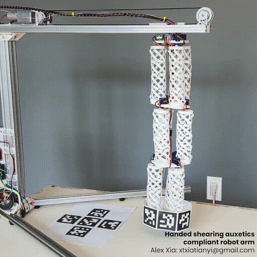
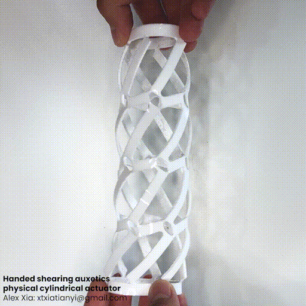

# Bending Robotic Arm

Built on compliant mechanisms, and handed shearing auxetics. Achieved a snake-like, organic movement. An optical positioning feedback loop completes the control system. The hardware interface is governed by Arduino.

### Achieved Flexibility

### Movement Range

## Author

Alex Xia, personal project. June-December 2024.

## Mechanism of Action

3D-printed, flexible muscles arrayed in sets of three, and stacked together allow for the movement range of the robotic arm. Parallelogram lattices are mapped onto the side surface of a cylinder of ID `38.4mm`. An axial twisting torque extends and contracts the muscle.

### Single Muscle Extension and Contraction

### Muscle Simulation, Blender

## The Concept

Unlike traditional robotic arms, which pivot rigidly around bearings, the compliant muscles allow this arm to bend and twist upon itself, making this special, in my eyes. The snake-like organic movements contrast with the elbowing motion of assembly-line robots, for instance. 

The soft plastics of which the muscles are composed grant safety and simplicity to the design: there are no heavy metal parts moving – which eases assembly – and few differing components (only light servo motors, wiring, and plastic parts).

I see further iterations of this prototype interacting with humans, in palliative care, for example, and for microscopic manipulation.

## How it Works

3D-printed, flexible, cylindrical muscles which contract and extend upon an axial twisting force are arrayed in sets of three, and then layered – achieving a smooth, flexing motion of the whole structure: a flexible and compliant robotic arm.

Each muscle consists of a matrix of parallelograms – which can be sheared into rectangles, achieving extension – mapped and curved onto the surface of a cylinder. 

9 servo motors individually apply torque on each of the muscles to attain a specific pose, which the target is confirmed by an optical positioning system (see Project 2).

This visual positioning data, indeed, completes the feedback loop. A Python script minimizes the distance between the achieved and desired pose, and relays the motor positions to the hardware-controlling Arduino using serial communication. The achieved kinematics resemble that of three stacked Stewart platforms.

## Codebase

- `shearing_auxetics/`: Auxetic materials research and prototypes of muscles
    - `openscad/`: V1: Mesh generation with OpenSCAD.
    - `blender/`: V2: Mesh generation with Python and Blender - final working version of muscles.
    - `render/`: Rendering of V2.
    - `simulation/`: Simulation of edges of V2.

- `arm/`: Implementation of shearing auxetics for the bending arm
    - `hardware/arm_interface`:
    - `software/`: 
        - `drafts/`: 
        - `mit/`: 

- `optical_positioning/`:
    - `optical_positioning/`: 
    - `b_calibrate/`: 
    - `c_calibrate_matrix/`: 
    - `drafts/`: 

## Contact

- [Tian Yi, "Alex", Xia](https://github.com/ThatAquarel), xtxiatianyi@gmail.com: 

## References

- Compliant Mechanisms (Howell, 2001).
- Handedness in Shearing Auxetics Creates Rigid and Compliant Structures (Lipton et al., 2018).
