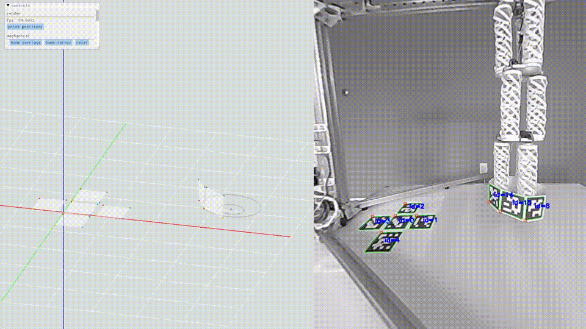
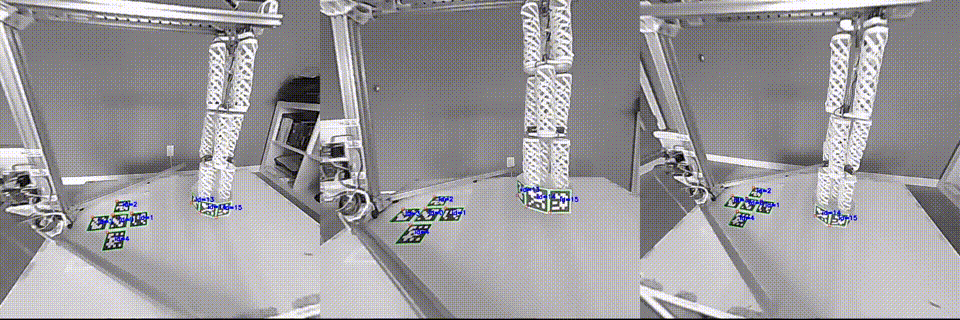
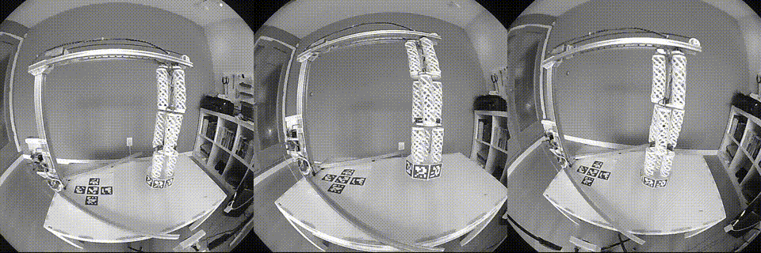

# Optical Positioning System

Three fisheye cameras locate ArUco markers within their field of view, and transform their perspectives into 3D positions.

### Custom 3D Motion Capture Software

### Marker Tracking

### Camera Views

## Author

Alex Xia, personal project. June-December 2024.

## Computer Vision Principles

The 3D-printed mounts for each of the cameras is my own design. The optical positioning pipeline, along with the feedback loop for my robotic arm, is also my own work built on open-source packages. OpenCV handled the ArUco marker generation and detection, and provided helper functions for calibrating the cameras, and solving for perspective, for example. However, making these preexisting tools work together reliably and fast was my responsibility. Most notably, the linear algebra to match the perspectives of the cameras to each other (the bulk of the computation) is my work, as optimizing my code for up to 120 frames per second required multithreading math.

The theory that backed this implementation was found in research papers and online articles which detailed the Perspective-n-Point problem, and OpenCV’s documentation. Dr. Anton's "Elementary Linear Algebra" also came in handy.

## Design Goals

In building my flexible robotic arm, I realized I needed a reliable positioning system for feedback. I knew that optical was the way to go, but due to the high price point of commercial options, I built my own for cheap, open-sourced it – all while serving as a learning experience for math. 

Currently, the cameras are fixed in place, while objects within their fields of view move: perfect for motion capture in robotics. A similar algorithm holds true if the cameras move, instead, which is my next goal. The cameras can then be placed on the end effector (or achieve the same perspective by the mediation of fiber optic cables) – a necessary field of view if we’re talking about surgery: a possible application for miniaturized flexible robotic arms. This extension of my positioning system is my current goal.

## How it Works

After researching the extravagant pricing options of OptiTrack, I bought three USB fisheye cameras with a 180deg lens for around 100$, and 3D-printed mounts to bolt onto cymbal stands I borrowed from my drum set.

I first calibrated each of the cameras, acquiring their projection and distortion matrices, with different pictures of a known-size checkerboard pattern. The image distorted by the fisheye lens can be undistorted using these matrices, making lines appear straight in-frame. This is crucial as the ArUco marker corner detection would not work otherwise.

Using a known cross pattern, I computed the relative transformation matrices between each camera using OpenCV’s Perspective-n-Point solver. The absolute position with respect to the cross pattern can be therefore determined for each subsequent marker that appears in at least two of the cameras.

## Requirements

- glfw==2.7.0
- imgui==2.0.0
- matplotlib==3.10.0
- numpy==2.2.1
- opencv_python==4.10.0.84
- PyOpenGL==3.1.7
- PyOpenGL==3.1.7
- scipy==1.15.0
- setuptools==69.5.1

## Codebase

- `optical_positioning/`: Optical positioning for motion tracking and control loop feedback
    - `optical_positioning/`: Optical positioning Python package root.
        - `a_constants.py`: Program constants: number of cameras, reference frame ArUco marker placements.
        - `b_calibrate.py`: Take calibration pictures.
        - `c_calibrate_matrix.py`: Fisheye camera calibration and distortion matrix acquisition.
        - `d_compute_pose.py`: 3D pose computation of detected markers from 3 perspectives.
        - `e_render.py`: OpenGL-based custom rendering engine for motion tracking.

    - `b_calibrate/`: Cached calibration images.
    - `c_calibrate_matrix/`: Cached calibration matrices.
    - `drafts/`: Testing code for iterative developement.

## Contact

- [Tian Yi, "Alex", Xia](https://github.com/ThatAquarel), xtxiatianyi@gmail.com: 
